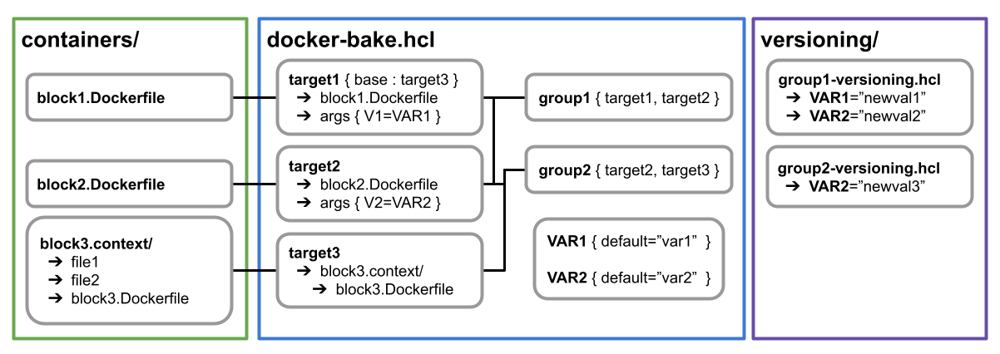

Build system structure
======================

The containers build system is based on [Docker](https://docs.docker.com/build/). 
It uses the [Buildkit](https://docs.docker.com/build/buildkit/) extension, which 
provides the abilities required to create containers from a modular build 
definition. It is split in 3 components that will be discussed in the following 
sections.

___

Container blocks defintion
--------------------------

Container blocks are placed inside the `containers/` directory. A container 
block specify all the commands required to build, install and test a single 
component used in the build system. It can be installing CMake in order to use 
it later to build something else or building a more complex dependency like 
ANTs or FSL. A block should be as minimal as possible, that is:

- it should install as little dependencies shared with other blocks as possible
- it should cleanup for any build toolchains and files unrequired at runtime

To achieve this two kind of Dockerfile definitions are allowed in the system:

- The single stage Dockerfile:
  - This kind includes two `FROM` directives, one where dependencies are 
    installed and files are copied, the other specifying tests to run after
  - Their usage is limited to sequences that cannot use a `dual stage Dockerfile`, 
    for example when copying files to the container, performing a `apt-get` or 
    setting environment variables
- The dual stage Dockerfile:
  - This kind uses three `FROM` directives, one where the dependencies are built 
    outside the container environment, one where the built dependencies are 
    installed in the container and one performing tests
  - Building the container this way allow to limit the build requirements 
    installed into the container as much as possible and is thus highly 
    recommended

### Local files

If a container requires local files other than the Dockerfile in its build 
context, its recipe and files should be placed in its own directory inside the 
`containers/` directory named `<name>.context`. For a target to use it as its 
context, modify the `context` parameter to point to it.

___

Container baking recipes
------------------------

In the build system, the containers are built using the `docker buildx bake` 
command, which uses `.hcl` files containing the definition of one or more 
container recipes. A `.hcl` file can contain 3 types of objects : `variables`, 
`groups` and `targets`.

### Building with multiple files

When a bake call is performed with multiple files, 
variables in a file get overwritten by their redefinitions in subsequent files. 
Groups and targets defined in multiple files are merged together. Their 
parameters are overwritten following the same logic than for variables.

### Main recipe

The main bake recipe is located in the file `docker-bake.hcl` at the root of the 
repository. It is pieced in 3 sections:

- At the top, all the `variables` are listed, such as dependencies versions, 
  global environment variables and paths that could be overwritten.
- Then `groups` are listed. They define a list of targets to build and its their 
  names that are used when calling `bake`. Thus, their names should also refer 
  to a main container to publish.
- Finally, `targets` are defined. A target always refer to a single Dockerfile 
  or block. It can define arguments to pass to the dockerfile (used to customize 
  the build sequences), tags to push to or get cache from, amongst others.

### Versioning

Versioning is made possible using the variables and their overwritting behavior  
when using multiple `.hcl` build files. For each of the containers of the Scilus 
ecosystem exists a file in the `versioning/` directory, defining the versions of 
the dependencies required to build it. Those variable can also be passed through 
the command line call to `bake`, by setting them by name in the environment of 
the build shell.

___

Build cache and publishing on Dockerhub
---------------------------------------

To keep the local docker image and container repository clean, most blocks that 
are built using the system's target aren't published to it and instead only live 
in the local build cache. Some of those caches can be quite heavy and it can be 
good to perform clean operation of the local docker build cache frequently. In 
order to retain as much of it as possible, the cache of critical blocks of the 
sequence is uploaded directly to Dockerhub.

The whole caching behavior can be turned off using the `bake` parameter `--no-cache`,
but it disables both incoming and outcoming cache. To only affect one or the 
other, use `--set=*.<cache-direction>="none"`, subtituting `<cache-direction>` 
with either `cache-from` or `cache-to`. This can also be used, to specify 
other cache locations, either local or remote. More information in the Buildkit 
[documentation](https://docs.docker.com/build/customize/bake/file-definition/).

In the same fashion, only some images get pushed to Dockerhub. This is done by 
specifying the `tags` parameter of targets to push. Targets that are always 
pushed have them directly specified in the main recipe. To add tags to targets 
that don't have them, or overwritte the ones already defined, multiple dockfiles 
can be used. The one placed after the main build definition redefines the build 
targets, only modifying the `tags` parameter.

___
